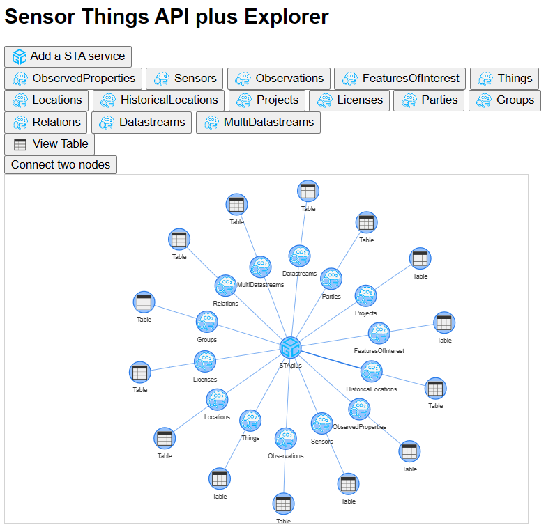

# TAPIS: Tables from APIs for Sensors. An STAplus Explorer
TAPIS is a API explorer and a table manager. TAPIS reads data and metadata from some supported APIs and some data file formats and structures the data as tables that can be managed and transformed. Internally, everything is a table that has columns that represents fields and rows that represent records.

The supported data sources are: Sensor Things API, STAplus, OGC API Features/Records, OGC Catalogue Service for the Web, S3 Services, Eclipse Data Connectors, CSV, DBF, JSON-LD, JSON and GeoJSON files. Once the data is represented as a table, it can be directly viewed, edited, semantically enriched, filtered, joint, grouped by, aggregated, etc.
A part of a classical rows and columns tabular representation, data can be presented as bar charts, pie charts, scatter plots, and maps. TAPIS is integrated with [NiMMbus](https://github.com/grumets/nimmbus) (MiraMon implementation of the Geospatial User Feedback) and with the [MiraMon Map Browser](https://github.com/grumets/MiraMonMapBrowser).

While the project is completely independent from the [Orange data mining](https://orangedatamining.com/) software, it has been inspired by its GUI design. If you have used Orange in the past, you will immediately know how TAPIS works.

But there are some differences with Orange:
* TAPIS is a JavaScript interface that does not required installation
* Columns can be semantically tagged adding meaning to the data fields
* TAPIS connect with external APIS such as SensorThings API (STA) and STAplus as sources for tabular data. 

